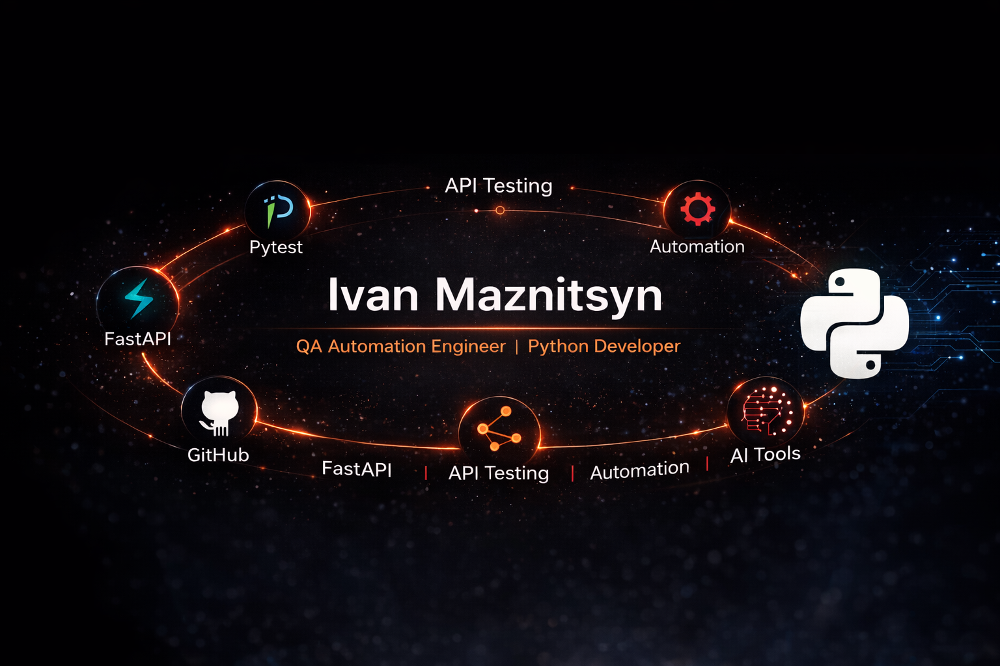

  

<h1 align="center">🖥️ Ivan Maznitsyn</h1>
<h3 align="center" style="color:#ff3333;">QA Engineer (Manual → Automation) & Python beginner developer</h3>

    
    
    
    
    

---

### 👋 Немного обо мне

Привет! Я Иван Мазницын — человек, который никогда не стоит на месте.  
Освоил ручное тестирование (функциональное, нефункциональное, чек-листы, тест-кейсы, баг-репорты).  
Сейчас двигаюсь дальше — изучаю автоматизацию в SkyPro и параллельно осваиваю Python.  

Я здесь, чтобы расти, строить реальные навыки и работать с современными инструментами.

---

### 🛠 Мои текущие скиллы

#### 🧪 **QA (Manual)**
- Тест-дизайн
- Тест-кейсы, чек-листы
- Postman (API-тестирование)
- Работа с Ёжкой, Енотом, Jira
- Написание баг-репортов
- Работа с требованиями

#### 📚 Текущее обучение
- Автоматизация тестирования в SkyPro
- Python (основы, условия, циклы, функции)

---

### 📬 Контакты

📧 **imidg18251972@gmail.com**

---

### ⚡ Философия  
Делаю шаг за шагом.  
Расту каждый день.  
Ответственность. Движение. Результат.

