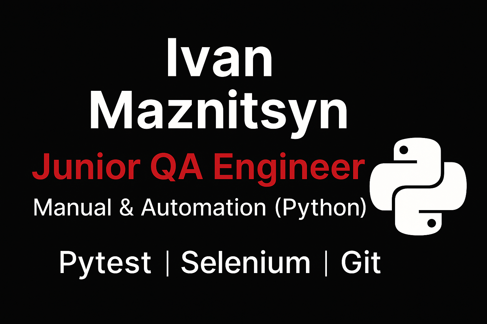

  

---

<h1 align="center">💻 Ivan Maznitsyn</h1>
<h3 align="center" style="color:#ff3333;">QA Engineer (Manual → Automation) & Python Beginner Developer</h3>

  
  
  
  
  
<h3 align="center">🧰 Мой стек</h3>

<b>Языки:</b> Python ·
<b>Тестирование:</b> Pytest · Selenium · Postman · API ·
<b>DevOps:</b> Docker · Linux/WSL ·
<b>Инструменты:</b> Git · GitHub · VS Code

<b>Test Management & Docs:</b> Jira · TestIT · BUN · Yonote

  <a href="#ai-mentor" style="text-decoration:none;">
    🤖 <b>Создал собственного AI-наставника для обучения Python и QA</b> ↓
  </a>

## 🧑‍💻 Обо мне

Я — Иван Мазницын, начинающий Python & QA Automation инженер.
Люблю порядок в коде, красивый интерфейс и автоматизацию всего, что можно автоматизировать.
📌 Занимаюсь:
### 🧪 Automation QA (Python)

**Делаю:** UI-автотесты и API-тесты, оформляю отчёты и веду проекты на GitHub.

✅ Стек:
- **Python**, **pytest**
- **Playwright** (UI автотесты)
- **requests** (API)
- **Allure Report** (отчёты)
- **Docker** (базово), Git/GitHub, VS Code

### 📌 Проекты
- 🔹 **Kinopoisk UI & API Autotests — Diploma Project**  
  Разработан полноценный фреймворк автоматизированного тестирования веб-приложения (UI + API) с архитектурным разделением слоёв, использованием Page Object Model, фикстур и параметризации, а также генерацией отчётов Allure.  
  Стек: Python, Pytest, Playwright, Requests, Allure, Git.  
  https://github.com/imidg1825/kinopoisk-ui-api-autotests

- 🔹 **KP Production Smoke Tests**  
  Реализован набор UI и API smoke-автотестов для проверки стабильности прод-среды после доработок фронтенда и бэкенда.  
  Тесты используются командой для быстрой валидации основных сценариев.  
  Стек: Python, Pytest, Playwright, Requests, Allure, Git.  
  https://github.com/imidg1825/kp-production-tests

- 🔹 **AQA SauceDemo (Playwright + pytest + Allure)**  
  https://github.com/imidg1825/aqa-saucedemo-login

- 🔹 **API testing (requests)**  
  https://github.com/imidg1825/python_lesson1/tree/main/08_lesson
### 💼 Опыт
**QA Intern / QA Engineer — Акатосфера (отдел качества)**  
Тестирование web-аукционов (ручное + автоматизация).  
Нашёл и оформил **30+ багов**, участвую в проверке пилотного продукта и нового решения на базе нейросети.

## 🛠 Мои навыки

 ### 🔧 QA Manual

- Тест-дизайн (чек-листы, тест-кейсы)
- Функциональное, регрессионное и smoke-тестирование
- Исследовательское (exploratory) тестирование
- Интеграционное и приёмочное тестирование
- Кроссбраузерное тестирование
- API-тестирование (Postman)
- Работа с баг-трекерами (Ёжка, Jira)
- Анализ и декомпозиция требований
- Поддержка тестовой документации
  
### 🚀 QA Automation 

## 🧠 Python
- 🐍 Базовый синтаксис, переменные, типы данных  
- 🔁 Циклы, условия  
- 📁 Работа с файлами (read/write)  
- 🛠 Мини-проекты и учебные задачи  

  

---

## 🔧 Git / GitHub
- 🌿 Работа с ветками (branching)
- 🔀 Слияние и разрешение конфликтов
- 🧩 GitGraph: визуализация истории
- 🕙 Откаты: *restore*, *reset*, *revert*
- 📤 Pull Requests
- 📝 Оформление README  
- 💫 Бейджи, кликабельные ссылки, визуальные элементы  

  

---

## 🧪 PyTest 
- 🧱 Структура тестового проекта  
- 🧪 Создание базовых тестов  
- 🏷 Маркировки и группировка  
- ▶️ Запуски через CLI  

  

---

## 🕷️ Selenium WebDriver

  

- 🌐 Установка Selenium WebDriver  
- 🧭 Навигация по страницам  
- 🔍 Поиск элементов (`find_element`)  
- 🎯 Действия: `click`, `send_keys`, `get`  
- 🧪 Первый UI-тест (Google search test)

  

---

## 🐳 Docker 

🧩 Создание и запуск контейнеров  
📦 Работа с образами (`build`, `run`, `pull`, `tag`)  
🧾 Написание `Dockerfile`  
🐍 Установка Python-зависимостей внутри контейнера  
🌐 Работа с сетями и портами  
💾 Создание томов (`volumes`)  
🧱 Основы Docker Compose  
🪄 Оптимизация образов (кэш, слои, размер)

  

🔧 **Git / GitHub**
- Работа с ветками (branching)
- Слияние, конфликт-мерджи, разрешение конфликтов
- GitGraph для визуализации истории
- Откат изменений (restore, reset, revert)
- Pull Requests и работа с репозиториями
- Оформление README, бейджи, кликабельные ссылки

🧪 **PyTest**
- Написание тестов на Python
- Структура тестового проекта

### 🗄 SQL
- SELECT / WHERE  
- JOIN  
- GROUP BY  
- Базовый анализ данных

---

## 🔗 Postman API Collections

### 🎬 **Kinopoisk API Tests (Smoke + Negative)**  
[➡ Открыть коллекцию в Postman](https://docking-module-participant-646848-2572445.postman.co/workspace/%D0%98%D0%B2%D0%B0%D0%BD-%D0%9C%D0%B0%D0%B7%D0%BD%D0%B8%D1%86%D1%8B%D0%BD's-Workspace~1ba03d02-e567-45fe-8c1d-85038528be26/collection/47167819-8db6da80-1438-4737-b5cf-9f82e3205902?action=share&creator=47167819&active-environment=47167819-079631b2-60f7-4ece-872a-6cb48afd16f9)

Коллекция включает:
- ✔ 3 позитивных теста  
- ❌ 5 негативных тестов  
- 🔧 Переменные окружения (`Kinopoisk_ENV`)
---
## ⚡ Как развернуть окружение за 5 минут

👉 Подробная инструкция по настройке VS Code, WSL и Python  
📄 [Открыть инструкцию](./setup-environment.md)

---

## 📂 Мои проекты

### 📝 **Первая курсовая работа (YoNote)**  
Первая большая учебная работа по тестированию: чек-листы, тест-кейсы, первый тест-ран и баг-репорты.

👉 [Открыть первую курсовую в YoNote](https://imidg1825.yonote.ru/share/c512ad97-0148-4e57-8bac-d78dbb622e95)

---

### 📝 **Тестовая документация (YoNote, финальная работа)**  
Финальная работа: чек-листы, тест-кейсы, тест-ран, баг-репорты, итоговый отчёт.

👉 [Открыть финальную работу в YoNote](https://imidg1825.yonote.ru/share/7561216a-d0de-4320-a426-cbaf86edd491)

---
### 🧪 Тестирование  
- 📌 Функциональные тест-кейсы  
- 📌 Нефункциональные тест-кейсы  
- 📌 Тест-план и тестовая документация  

👉 **[Все работы можно посмотреть здесь](https://imidg1825.yonote.ru/share/7561216a-d0de-4320-a426-cbaf86edd491)**  

### 🐞 Баг-репорты  
- 📌 **[Коллекция багов (Ёжка)](https://imidg1825.yonote.ru/share/7561216a-d0de-4320-a426-cbaf86edd491)**  

---

### 🔥 **API-проекты**

- **[Postman Tests Portfolio](https://github.com/imidg1825/postman-tests-portfolio)**  
  Коллекция Postman-тестов (smoke + negative):  
  проверки статусов, тела ответа, ошибок, переменные окружения.  
  **API:** Kinopoisk, Yandex Rasp, YouGile
- **Yandex Rasp API (Postman)**  
  Тестирование расписаний: маршруты, станции, параметры запросов
- **Kinopoisk API**  
  Поиск фильмов, получение данных по ID, негативные сценарии
- **YouGile API**  
  CRUD-операции, проверки авторизации и валидации ответов
---

### 🐍 Мой репозиторий по Python  
Учусь Python с нуля. Занимаюсь каждый день, веду отдельный репозиторий со всеми уроками, шпаргалками и мини-задачами.

👉 [Перейти в репозиторий Python](https://github.com/imidg1825/python_training_2025)

---
### 📘 Репозиторий с домашними заданиями SkyPro (Python)

Это мой учебный репозиторий, куда я выкладываю домашние задания по курсу  
**«Автоматизация тестирования на Python» (SkyPro)**.  
Здесь — мои первые функции, циклы, работа с файлами, тестовые задачи и весь прогресс.

👉 [Перейти в репозиторий python_lesson1](https://github.com/imidg1825/python_lesson1)

---

### 🧠 **Git-практика**

  

👉 **Репозиторий:**  
[git_training_ivan](https://github.com/imidg1825/git-training-ivan)

🛠 **Изучаю:** ветки, конфликты, мерджи, GitGraph, GitHub flow.

---

## 🐳 Docker-практика

📁 **Репозиторий:**  
[docker-training-ivan](https://github.com/imidg1825/docker-training-ivan)

📝 **Изучаю:**  
Контейнеры, образы, Dockerfile, зависимости Python внутри контейнера,  
работа с портами и сетями, тома, основы Docker Compose, DevOps-подход.

---
## 🤖 Мой AI-наставник — Python QA Mentor PRO
Я создал собственного AI-наставника для обучения Python и QA Automation.  
Он помогает разбирать код и ошибки, объясняет инструменты простым языком и
помогает тренироваться на реальных QA-задачах.Если пользуешся chatgpt
 и тебе интересно переходи по ссылке
👉 **Открыть AI-наставника:**  
https://chatgpt.com/g/g-69312d733318819181e22b0fffe5c7fe-python-qa-mentor-pro

---

## ⚡ Факты обо мне  
- ❤️ Люблю порядок в данных и творческий хаос в жизни  
- 🤖 Использую AI-инструменты для ускорения работы  
- 🚀 Каждый день становлюсь лучше  
---

## ⚙️ Мои настройки VS Code
В работе использую аккуратно настроенный VS Code с расширениями для Python, Docker, Git и удобного интерфейса.
📦 **Мой список установленных расширений VS Code:**  
👉 👉 [extensions-list.md](extensions-list.md)
Этот список помогает быстро восстановить окружение на новом компьютере и показывает, с каким инструментарием я работаю ежедневно.
## 📦 Дополнительные расширения VS Code (рекомендации)
В будущем планирую расширять набор инструментов для Python, DevOps и документации.
🔧 Рекомендации на будущее:  
📁 [`extensions-recommended.txt`](./extensions-recommended.txt)

---

## 📫 Связаться со мной
- 📬 Telegram: [@Ivan_Maznitsin](https://t.me/Ivan_Maznitsin)

- Email: **imidg18251972@gmail.com**

  

